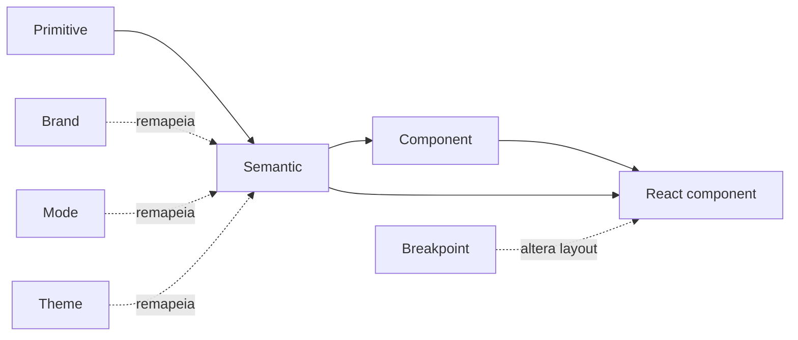

# 2. Arquitetura de tokens

Este documento é o contrato arquitetural do Flytrap. Ele explica onde uma decisão deve viver, como percorre Figma → DTCG → CSS → componente e o que humanos ou agentes de IA podem inferir com segurança.

## Modelo mental

```text
PRIMITIVE                    SEMANTIC                     COMPONENT
valor disponível            intenção de interface        controle específico

magenta.500          →       action.primary.bg     →      button.primary.bg.default
neutral.900          →       content.primary       →      chat.assistant.fg
space.4              →       layout.gap.default    →      agent-card.content.gap

"o que existe?"              "para que serve?"            "onde preciso controlar?"
```

As camadas são responsabilidades. Brand, mode, theme e viewport são dimensões que alteram resolução ou composição; não são novas camadas.

## Regra de dependência



- Primitive nunca referencia semantic ou component.
- Semantic referencia primitive ou outro semantic estrutural.
- Component referencia semantic ou foundation; nunca primitive de cor.
- Um componente pode consumir semantic diretamente quando não precisa de controle próprio.
- Breakpoint altera composição e densidade; não decide a intenção de uma cor.

O gate `token_contract.py` verifica referências, ciclos e fronteiras da camada Component.

## Camada 1 — Primitive

Primitives armazenam valores brutos, agnósticos de uso. Eles respondem: **quais matérias-primas estão disponíveis?**

### Categorias

| Categoria | Estrutura | Exemplos |
|--|--|--|
| Color ramps | 50 → 950 | `primitive.magenta.500`, `primitive.neutral.900` |
| Spacing | escala base de 4px | `foundation.space.1`, `foundation.space.4`, `foundation.space.16` |
| Typography | family, size, weight, line-height | `foundation.font.size.md`, `foundation.font.weight.semibold` |
| Border | width e radius | `foundation.border.width.default`, `foundation.radius.lg` |
| Motion | duration e easing | `foundation.motion.fast`, `foundation.motion.ease-organic` |
| Iconography | size e stroke | `foundation.icon.size.md`, `foundation.icon.stroke` |
| Breakpoint | largura mínima | `foundation.breakpoint.md` |

No DTCG, `foundation` reúne primitives não cromáticos para manter o vocabulário legível. Arquiteturalmente, ambos ocupam a camada de valores fundamentais: não carregam intenção de produto.

### Regras

- O nome descreve o valor ou a escala, nunca o uso: `magenta.500`, não `button.pink`.
- Adicionar valor exige evidência de necessidade recorrente; não se cria um token para esconder um número isolado.
- Cor funcional (`success`, `warning`, `error`) tem ramp própria; `acid` continua sendo marca, não sucesso.
- Componentes não consomem ramps diretamente.

## Camada 2 — Semantic

Semantic tokens são aliases de intenção. Eles respondem: **qual função este valor exerce na interface?**

O contrato CSS do shadcn exige nomes compactos como `--background` e `--primary`. No Flytrap, esses nomes são a representação runtime de uma taxonomia lógica mais explícita:

| Família semântica | Pergunta | Runtime atual |
|--|--|--|
| Surface | onde o conteúdo repousa? | `background`, `card`, `popover`, `muted` |
| Content | qual hierarquia o conteúdo possui? | `foreground`, `muted-foreground`, `*-foreground` |
| Action | qual ação e estado? | `primary`, `primary-hover`, `secondary`, `destructive` |
| Border/focus | qual separação ou foco? | `border`, `input`, `ring` |
| Feedback | qual resultado do sistema? | `success`, `warning`, `error` |
| Data visualization | qual série distinguível? | `chart-1` … `chart-5` |
| Navigation | qual contexto de navegação? | `sidebar-*` |
| AI | qual estado de agent/chat/tool? | `ai-agent-*`, `ai-thinking`, `ai-tool-bg`, `ai-citation` |

### Estrutura recomendada para novos nomes

```text
[domain].[role].[variant].[state].[property]
```

Exemplos conceituais:

```text
color.action.primary.default.background
color.action.primary.hover.foreground
color.content.secondary
color.surface.elevated
ai.agent.running.foreground
```

Não é obrigatório preencher todos os segmentos. O nome deve ser tão específico quanto necessário para impedir ambiguidade, e não mais específico que o reuso real.

### Quando criar um semantic token

Crie quando a intenção:

- reaparece em mais de uma página ou componente;
- precisa mudar por mode, theme ou brand;
- forma um par de contraste verificável;
- precisa ser compreendida por Product Design, Development e IA.

Não crie aliases apenas para renomear cada primitive. Isso aumenta escolha sem aumentar entendimento.

## Camada 3 — Component

Component tokens controlam uma parte anatômica ou estado de um componente. Eles respondem: **onde precisamos de decisão ou migração independente?**

```text
component.button-primary-bg
  → semantic.primary
  → primitive.magenta.500

component.button-primary-bg-hover
  → semantic.primary-hover
  → primitive.magenta.600
```

### Critério de entrada

Um component token só deve existir quando pelo menos uma condição for verdadeira:

- há estados próprios (`hover`, `disabled`, `error`, `loading`);
- o componente precisa evoluir sem alterar todos os consumidores do semantic;
- a anatomia exige documentação explícita;
- existe migração gradual entre contratos;
- o mesmo semantic é adaptado de forma controlada para aquele componente.

Para elementos simples, consumir semantic diretamente é correto. A camada Component é estratégica, não obrigatória nem decorativa.

## Cadeia real de resolução

| Etapa | Exemplo |
|--|--|
| DTCG primitive | `primitive.magenta.600 = #CF006A` |
| DTCG semantic | `semantic.primary-hover = {primitive.magenta.600}` |
| DTCG component | `component.button-primary-bg-hover = {semantic.primary-hover}` |
| CSS gerado | `--button-primary-bg-hover: var(--primary-hover)` |
| Tailwind theme | `--color-button-primary-bg-hover` |
| React | `hover:bg-button-primary-bg-hover` |

Trocar um valor não exige buscar hexadecimais no produto. Trocar intenção exige remapear semantic. Trocar somente Button exige component token.

## Dimensões do sistema

### Brand

Brand determina identidade: paleta, tipografia expressiva e decisões de marca. Apenas `flytrap` está materializada hoje.

Uma nova marca não entra apenas com outra paleta. Ela precisa de DTCG, semantic mappings e matriz APCA completos. O objetivo é compartilhar componentes, não fingir que marcas diferentes têm ramps com nomes falsos iguais.

### Mode

Mode representa condição de aparência ou preferência ambiental:

- `light`: superfícies claras e conteúdo escuro;
- `dark`: superfícies escuras e conteúdo claro.

Mode remapeia semantic tokens. Componentes não possuem lógica própria de dark mode.

### Theme

Theme representa expressão visual dentro da marca:

- `default`: expressão principal e neutra;
- `vibrant`: expressão imersiva, magenta/acid, usada em superfícies especiais.

Hoje o produto publica três aparências validadas: `light`, `dark` e `vibrant`. `vibrant` já é implementado como seletor de theme, mas ainda não possui combinações independentes `light+vibrant` e `dark+vibrant`. Essa expansão deve acontecer apenas quando houver casos de uso e pares APCA calibrados para o produto cartesiano completo.

### Viewport e breakpoints

Flytrap é mobile-first. O layout base vale abaixo de `sm`; breakpoints adicionam capacidade, não detectam dispositivos.

| Token | Min-width | Uso típico |
|--|--:|--|
| base | 0 | uma coluna, navegação compacta |
| `sm` | 640px | agrupamentos simples |
| `md` | 768px | duas colunas, controles expandidos |
| `lg` | 1024px | sidebar persistente e layouts compostos |
| `xl` | 1280px | dashboards densos |
| `2xl` | 1536px | conteúdo amplo com limite de leitura |

Regras:

- Prefira container queries para componentes reutilizáveis quando o comportamento depender do espaço do container.
- Use viewport breakpoints para shells e macro-layout.
- Não crie um breakpoint para corrigir um componente específico.
- Tipografia responsiva deve preservar hierarquia e legibilidade, não apenas diminuir proporcionalmente.

## Responsabilidades por plataforma

| Decisão | Figma | DTCG | CSS/Tailwind | React |
|--|--|--|--|--|
| Valor bruto | variável primitive | fonte de verdade | custom property gerada | proibido direto |
| Intenção | variável semantic | alias + modes/themes | utility semântica | classe semântica |
| Anatomia/estado | component property | component token | utility de componente | variant/state |
| Responsividade | frames/auto layout | breakpoint foundation | responsive/container utility | composição |
| Acessibilidade | contraste/anotação | metadado APCA | focus/forced colors | semântica/ARIA/teclado |

## Fonte única e automação

```text
packages/tokens/src/flytrap.tokens.json
  ├── primitive
  ├── foundation
  ├── semantic
  ├── component
  └── color (manifesto de pares APCA)
        ↓
packages/tokens/build.mjs
        ↓
dist/flytrap-globals.css + dist/tokens.ts
```

- `build.mjs` transforma; não contém decisões visuais.
- `token_contract.py` resolve aliases, detecta ciclos e protege fronteiras.
- `apca_gate.py` valida pares anotados nas aparências registradas.
- CSS e TypeScript gerados não são editados manualmente.

## Decisão rápida: onde este valor vive?

```text
É valor bruto reutilizável?
  sim → primitive/foundation
  não ↓

Expressa função recorrente na interface?
  sim → semantic
  não ↓

Controla anatomia/estado específico e justificado?
  sim → component
  não → mantenha local até existir padrão; não crie token preventivo
```

## Aprendizados adotados

- Três níveis com responsabilidades e migração gradual, preservando contratos antigos até concluir adoção: [Arquitetura com escala — Estação Asaas](https://medium.com/estacao-asaas/arquitetura-com-escala-construindo-tokens-em-um-design-system-ativo-ddf897845d32).
- Primitives descrevem o que são; aliases descrevem o que fazem; aliases devem nascer de reuso e contexto, não de cobertura infinita: [Turbine seu Design System com Design Tokens](https://brasil.uxdesign.cc/turbine-seu-design-system-com-design-tokens-12553635b31d).
- Separação de responsabilidades e nomes intencionais tornam theme switching e manutenção previsíveis: [Design Tokens com intenção e contexto](https://ocoelhobranco.medium.com/design-tokens-com-inten%C3%A7%C3%A3o-e-contexto-5a4f87d996fd).
- Theme engine precisa de contrato explícito para ferramentas aplicarem uma marca sem copiar estilos manualmente: [Aplica Theme Engine](https://ocoelhobranco.medium.com/como-ensinei-o-claude-e-o-cursor-a-adaptar-design-systems-com-o-aplica-theme-engine-956a48d8fe9c).
- IA não deve adivinhar primitives, componentes ou classes; qualidade depende do sistema de contexto fornecido: [A IA não erra à toa](https://ocoelhobranco.medium.com/a-ia-n%C3%A3o-erra-%C3%A0-toa-o-problema-%C3%A9-o-sistema-que-voc%C3%AA-deu-para-ela-c497f5986c42).

Esses artigos são repertório de aprendizagem. O contrato normativo do Flytrap continua sendo o DTCG versionado, os gates automatizados e as decisões registradas neste repositório.
