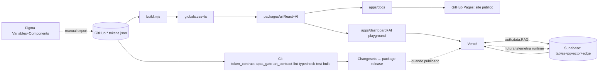

# 7. Pipeline Figma → Deploy

10 fases. Ferramentas: Figma · GitHub Actions/Pages · Vercel · Supabase.

## Fases
- **F1 Design** (Figma): Variables (primitive/semantic, modes por brand) + componentes.
- **F2 Tokenização**: hoje é um processo manual de reconciliação para DTCG no repo; ver [Sincronização design → código](19-design-code-sync.md).
- **F3 Build tokens**: gerador `build.mjs` → `flytrap-globals.css` + `tokens.ts`.
- **F4 Componentes**: `@louizeb/flytrap-ui` (base, charts e AI).
- **F5 Qualidade**: token contract · APCA · art contract · lint · typecheck · coverage · build.
- **F6 Release**: Changesets → SemVer → pacote npm/GitHub quando houver release owner.
- **F7 Docs**: catálogo React + Vite publicado por GitHub Pages.
- **F8 Backend**: Supabase (tabelas, RAG, edge functions).
- **F9 Deploy**: GitHub Pages para docs; Vercel para dashboard e previews.
- **F10 Telemetria**: baseline estático por `pnpm adoption:report` validado em CI por `pnpm adoption:check`; runtime futura → Supabase → dashboard → realimenta F1.

Caminho crítico: tokens → ui → deploy. Backend paralelizável.
