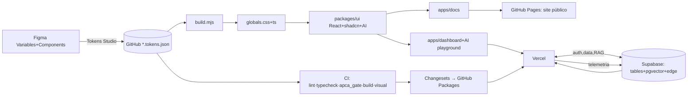

# 7. Pipeline Figma → Deploy

10 fases. Ferramentas: Figma · GitHub Actions/Pages · Vercel · Supabase.

## Fases
- **F1 Design** (Figma): Variables (primitive/semantic, modes por brand) + componentes.
- **F2 Tokenização**: Tokens Studio → DTCG no repo.
- **F3 Build tokens**: gerador `build.mjs` → `flytrap-globals.css` + `tokens.ts`.
- **F4 Componentes**: `@flytrap/ui` (shadcn + charts + AI).
- **F5 Qualidade**: lint · typecheck · **apca_gate** · visual · a11y.
- **F6 Release**: Changesets → SemVer → GitHub Packages.
- **F7 Docs**: catálogo React + Vite publicado por GitHub Pages.
- **F8 Backend**: Supabase (tabelas, RAG, edge functions).
- **F9 Deploy**: GitHub Pages para docs; Vercel para dashboard e previews.
- **F10 Telemetria**: adesão → Supabase → dashboard → realimenta F1.

Caminho crítico: tokens → ui → deploy. Backend paralelizável.
